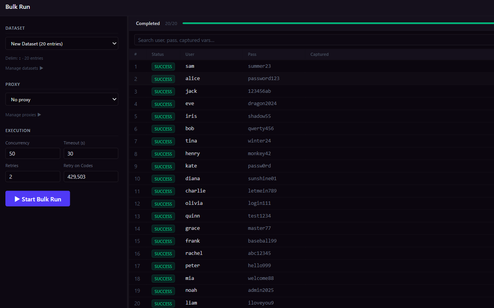
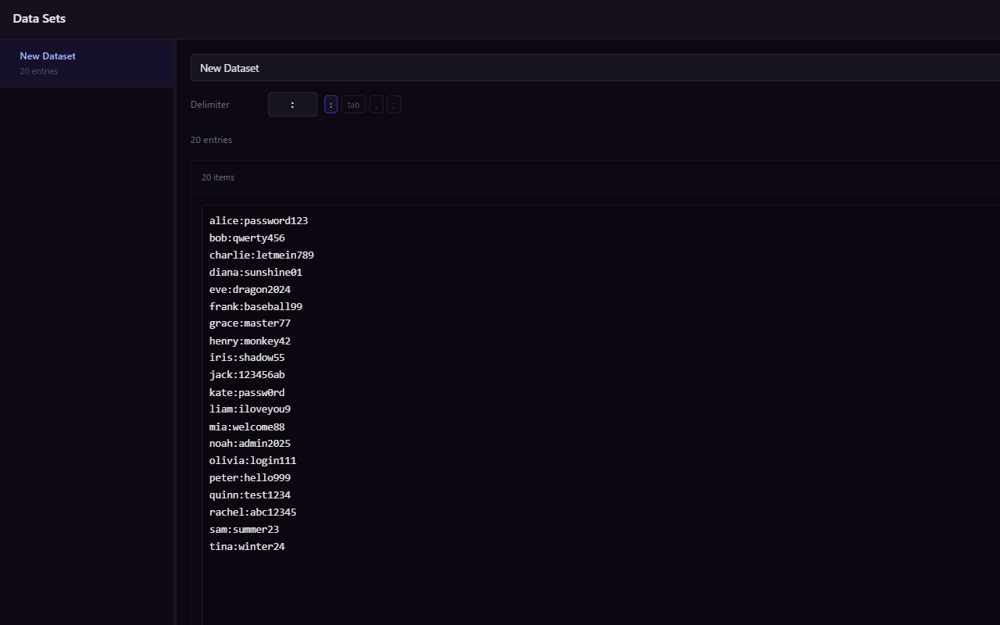
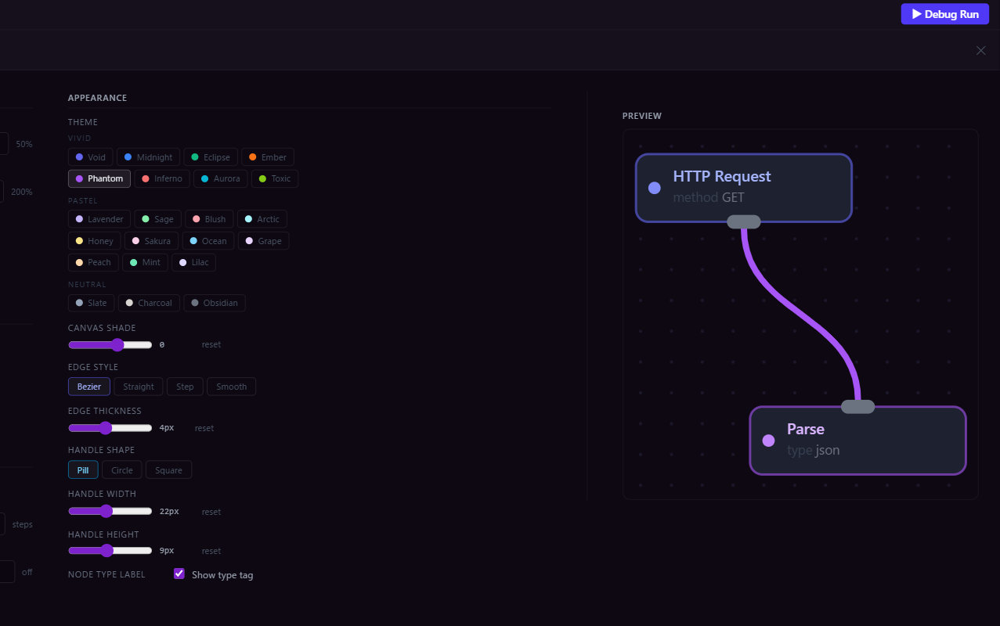
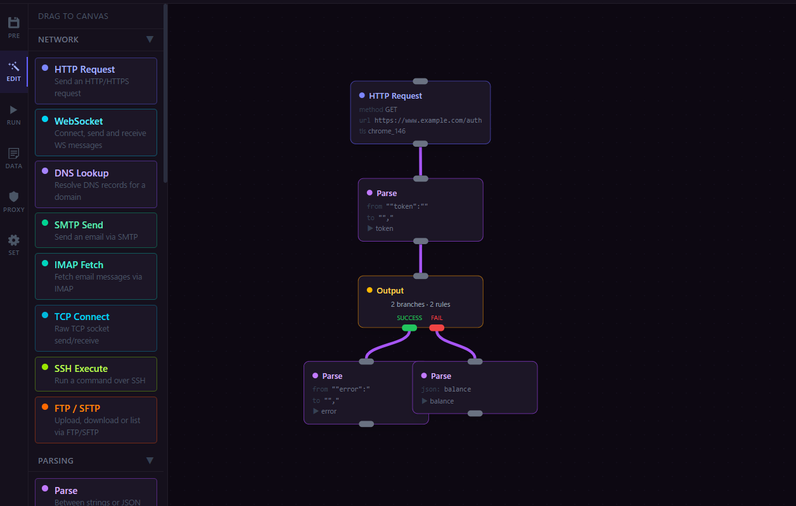

<p align="center">
  
</p>

# Axiom

A desktop app for building and running HTTP automation flows. This is an app to perform requests towards a target webapp and offers a lot of tools to work with the results. It can be used for scraping and parsing.

<table border="0">
  <tr>
    <td></td>
    <td></td>
  </tr>
  <tr>
    <td></td>
    <td></td>
  </tr>
</table>

## Features

- Node-based flow editor
- HTTP request node with TLS fingerprinting, cookie sessions, and rate limiting
- String and regex transformation nodes
- Dataset management for input data
- Proxy list management with rotation
- Job runner with real-time results table

## Download

Get the latest release from the [Releases](../../releases/latest) page.

| Platform | File |
|---|---|
| Windows | `Axiom-amd64-installer.exe` |
| macOS | `Axiom-macos.dmg` |
| Linux | `Axiom-linux-amd64.tar.gz` |

> **Windows:** SmartScreen may warn on first launch. Click "More info" → "Run anyway". We are currently trying to obtain a digital certificate on Windows.
> **macOS:** If blocked by Gatekeeper, right-click the app → Open.  
> **Linux:** Requires `libwebkit2gtk-4.1` and `libgtk-3`.

## Building from Source

**Requirements:** Go 1.25+, Node.js 20+, [Wails v2](https://wails.io)

```bash
git clone https://github.com/Pe11u/axiom.git
cd axiom
wails dev
```

To build:

```bash
# Windows
wails build -nsis

# macOS
wails build

# Linux
wails build -tags webkit2_41
```

## License

MIT — see [LICENSE](LICENSE)
